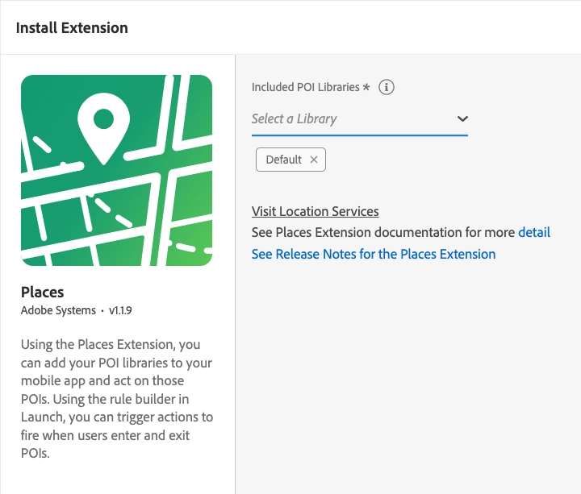

# Adobe Experience Places Service

Adobe Experience Platform Location Service provides an SDK extension which allows you to act based on the location of your users. This extension is the interface to the [Location Service Web Services APIs](https://experienceleague.adobe.com/docs/places/using/web-service-api/places-web-services.html?lang=en).

The SDK extension listens for events that contain GPS coordinates and geofence region events, and dispatches new events that are processed by the Rules Engine. The SDK extension also retrieves and delivers a list of the nearest POI for the app data that retrieves from the APIs. The regions returned by the APIs are stored in cache and persistence, which allows limited offline processing.

`Places` is the mobile SDK supporting the Location Service.

## Configure the Places extension in Data Collection UI

1. In the Data Collection UI, from your mobile property, select the **Extensions** tab.
2. On the **Catalog** tab, locate or search for the **Places** extension, and select **Install**.
3. Select the **POI Library (or libraries)** you wish to use in the app.
4. Select **Save**.
5. Follow the publishing process to update SDK configuration.



## Add the AEP Places extension to your app

The Places extension depends on the Core extension:
* [Mobile Core](https://github.com/adobe/aepsdk-core-android)

1. Installation via [Maven](https://maven.apache.org/) & [Gradle](https://gradle.org/) is the easiest and recommended way to get the Mobile SDK. Add the Mobile Core and Places extensions to your project using the app's Gradle file.

```java
implementation 'com.adobe.marketing.mobile:core:2.+'
implementation 'com.adobe.marketing.mobile:places:2.+'
```
#### Kotlin

```kotlin
    implementation(platform("com.adobe.marketing.mobile:sdk-bom:3.+"))
    implementation("com.adobe.marketing.mobile:core")
    implementation("com.adobe.marketing.mobile:places")
    implementation("com.adobe.marketing.mobile:analytics")
```

#### Groovy
    
```groovy
    implementation platform('com.adobe.marketing.mobile:sdk-bom:3.+')
    implementation 'com.adobe.marketing.mobile:core'
    implementation 'com.adobe.marketing.mobile:places'
```


> **Warning**
> Using dynamic dependency versions is not recommended for production apps. Refer to [this page](https://github.com/adobe/aepsdk-core-android/blob/main/Documentation/MobileCore/gradle-dependencies.md) for managing gradle dependencies.

2. Import the Mobile Core and Places extensions in your application's main activity.

#### Java

```java
import com.adobe.marketing.mobile.MobileCore;
import com.adobe.marketing.mobile.Places;
```

#### Kotlin

```kotlin
import com.adobe.marketing.mobile.MobileCore
import com.adobe.marketing.mobile.Places
```

## Register the Places extension with Mobile Core

Call the `setApplication()` method once in the `onCreate()` method of your main activity.

For example, your code might look like the following:

#### Java

```java
public class MainApp extends Application {
    private static final String APP_ID = "YOUR_APP_ID";

    @Override
    public void onCreate() {
        super.onCreate();

        MobileCore.setApplication(this);
        MobileCore.configureWithAppID(APP_ID);

        List<Class<? extends Extension>> extensions = new ArrayList<>();
        extensions.add(Places.EXTENSION);
        MobileCore.registerExtensions(extensions, o -> {
            Log.d(LOG_TAG, "AEP Mobile SDK is initialized");
        });
    }

}
```

#### Kotlin

```kotlin
class MyApp : Application() {

    override fun onCreate() {
        super.onCreate()
        MobileCore.setApplication(this)
        MobileCore.configureWithAppID("YOUR_APP_ID")

        val extensions = listOf(Places.EXTENSION)
        MobileCore.registerExtensions(extensions) {
            Log.d(LOG_TAG, "AEP Mobile SDK is initialized")
        }
    }

}
```

## Implement Places APIs

For more information about implementing Places extension APIs, please read the [Places API reference](./api-usage.md).


## Configuration keys

To update SDK configuration programmatically, use the following information to change your Places configuration values. For more information, see the [Configuration API reference](https://github.com/adobe/aepsdk-core-android).

| Key | Required | Description | Data Type |
| :--- | :--- | :--- | :--- |
| `places.endpoint` | Yes | Sets the endpoint used by the SDK to communicate with the Places Query Service. | String |
| `__dev__places.endpoint` | No | Sets the endpoint used by the SDK to communicate with the Places Query Service in the development environment. | String |
| `__stage__places.endpoint` | No | Sets the endpoint used by the SDK to communicate with the Places Query Service in the staging environment. | String |
| `places.libraries` | Yes | Sets the Places libraries to be used when communicating with the Places Query Service. | Array of Objects |
| `places.membershipttl` | No |	Default value of 3600 (seconds in an hour). Indicates how long, in seconds, Places membership information for the device will remain valid. | Integer |